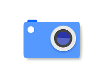
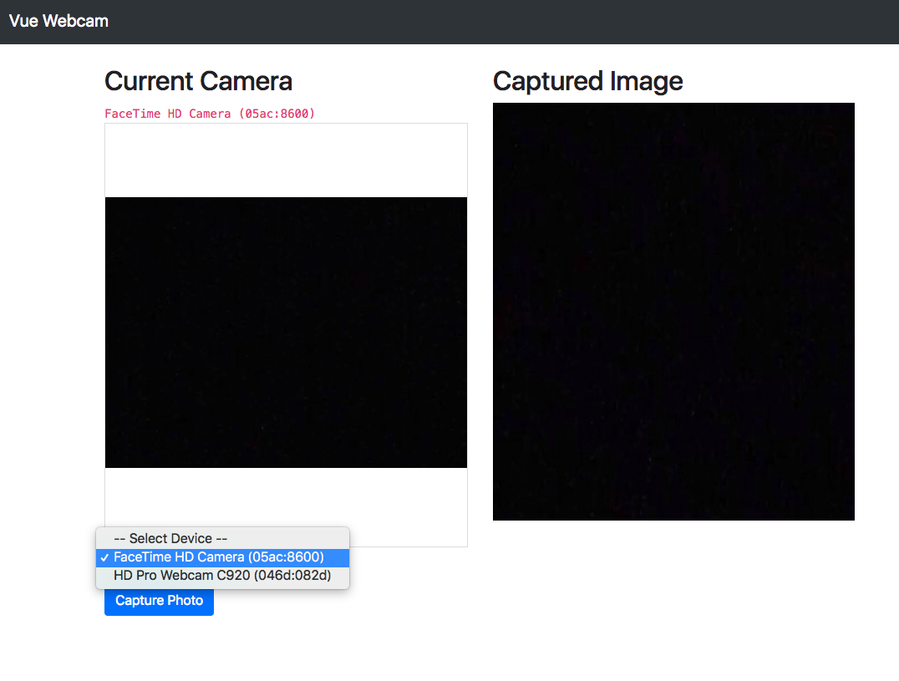

<p align="center">
    
</p>

<p align="center">
    
</p>

# vue-web-cam

[](https://www.npmjs.com/package/vue-web-cam)
[](https://www.npmjs.com/package/vue-web-cam)

[](https://opensource.org/licenses/MIT)

Webcam component for VueJs. See [this](http://caniuse.com/#feat=stream)
for browser compatibility.

## Installation

```bash
npm install vue-web-cam --save
// or
yarn add vue-web-cam
```

## Usage

```js
import Vue from 'vue'
import WebCam from "../../src";
Vue.use(WebCam);


<vue-web-cam ... />

// or
import { WebCam } from "vue-web-cam";

components: {
    WebCam
}

<web-cam ... />

components: {
    'vue-web-cam': WebCam
}

<vue-web-cam ... />
```

## Nuxt.js

Add `vue-web-cam/nuxt` to modules section of `nuxt.config.js`

```javascript
{
  modules: ['vue-web-cam/nuxt']
}
```

## Testing & Dev

```bash
npm run dev
```

### Props

| prop              | type    | default      | notes                                              |
| ----------------- | ------- | ------------ | -------------------------------------------------- |
| height            | number  | 500          | height of video element                            |
| width             | number  | 500          | width of video element                             |
| autoplay          | boolean | true         | autoplay attribute                                 |
| screenshotFormat  | string  | 'image/jpeg' | format of screenshot                               |
| selectFirstDevice | boolean | false        | select first device when avaialble                 |
| deviceId          | string  | null         | currently selected camera                          |
| playsinline       | boolean | true         | playsinline of video element                       |
| resolution        | object  | null         | object with width and height for camera resolution |

### Events

| name          | param    | notes                                                         |
| ------------- | -------- | ------------------------------------------------------------- |
| started       | stream   | emitted once the stream has started                           |
| stopped       | stream   | emitted once the stream has stopped                           |
| error         | error    | emitted if the stream failed to start with the error returned |
| notsupported  | error    | emitted when the browser does not support this feature        |
| cameras       | cameras  | emitted when a list of all cameras available is loaded        |
| camera-change | deviceId | emitted when camera change occurs                             |
| video-live    | stream   | emitted when video is started                                 |

### Methods

| name         | param    | notes                                                                                                 |
| ------------ | -------- | ----------------------------------------------------------------------------------------------------- |
| capture      | void     | Capture the current image through the webcam as base64 encoded string                                 |
| changeCamera | deviceId | change the currently selected camera. Must pass in the device ID                                      |
| start        | void     | Programmatically Start the camera after stopping it (relies on deviceId prop passed to the component) |
| stop         | void     | Programmatically stop the camera                                                                      |
| pause        | void     | Programmatically pause the camera                                                                     |
| resume       | void     | Programmatically resume the camera after it was paused                                                |

## Contributing

If you'd like to help make this project better you can help with the following tasks:

- Tests - This project needs a way to test the functionality using a javascript testing solution (Jest as an example)
- Examples - Additional Examples of usage might be helpful to others.
- Project Website - Perhaps launch a project website (on Github Pages) that'll showcase the plugin, Demo, Usage instructions, configuration etc..

## License

MIT

## Credits

This is based off [@smronju vue-webcam](https://github.com/smronju/vue-webcam) and [react-webcam](https://github.com/mozmorris/react-webcam)
